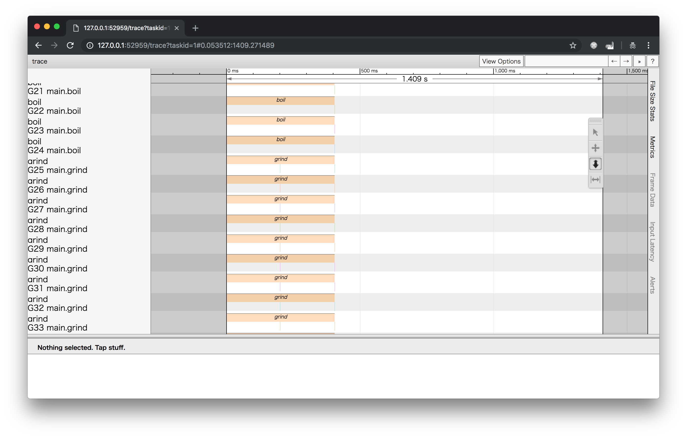

# STEP 3: ゴールーチンとチャネル

## ゴールーチン

Goには、ゴールーチンという並行処理を行うための機能があります。
次のように、`go`というキーワードを用いて関数呼び出しを行うと新しいゴールーチンで関数を呼び出すことができます。

```go
go f()
```

ゴールーチンは、非常に軽量でOSのスレッドの上に複数動きます。
デフォルトでは、論理CPU数と同じ数だけ並列に動くことが可能です。
複数のゴールーチンの処理をどのように切り替えるかについては、Goのランタイムがスケジューリングを行うため、ユーザは気にする必要がありません。

## チャネル

ゴールーチンを用いると関数を独立して動作させることができます。
ゴールーチン間のデータのやりとりはどのように行えばよいのでしょうか？

次のように、共有の変数を用いる方法はどうでしょうか。

```go
func main() {
    var done bool
    go func() {
        // 重たい処理
        time.Sleep(2 * time.Second)
        done := true
    }()

    // 処理が終わるまで待つ
    for done {
        time.Sleep(10 * time.Millisecond)
    }
}
```

この例では、1つのゴールーチンでしか変数`done`に書き込んでいないので大きな問題は起きませんが、共有の変数に同時に読み書きが発生すると競合が起きてしまいます。

そこでGoでは、ゴールーチン間のデータのやりとりにチャネルというデータ構造を用います。
チャネルはゴールーチン間の通信を行うデータ型で次のように利用することができます。

```go
func main() {
    done := make(chan bool)
    go func() {
        // 重たい処理
        time.Sleep(2 * time.Second)
        done <- true
    }()

    // 処理が終わるまで待つ
    <-done
}
```

チャネルの初期化には、組込みの`make`関数を用います。
`make`関数には、`chan bool`のようなチャネルを表す型を指定します。
`chan bool`は`bool`型のデータをやり取りするためのチャネルを表します。

`done <- true`のように書くことでチャネルに値を送ることができます。
また、`<-done`のように書くと、チャネルから値を受信することができます。

チャネルの送受信ではデータが受信・送信されるまで処理がブロックされます。
なお、ここでは扱いませんがチャネルに空きバッファがある場合はブロックされずに処理が進みます。

チャネルは、引数や戻り値に渡すことができます。
その際、`chan bool`のように型を書くと送受信可能なチャネルになってしまうため、
引数の場合には`chan<- bool`、戻り値の場合には`<-chan bool`と書くことで、受信または送信限定のチャネルとすることができます。

## 実行とトレースデータの表示

`TODO`を埋めると次のコマンドで実行することができます。

```
$ go run main.go
```

`trace.out`というトレース情報を記録したファイルが出力されるため、次のコマンドで結果を表示します。

```
$ go tool trace trace.out
```

ブラウザが開くので、`User-defined tasks` -> `Count` -> `Task 1`の順番で開くと次のような結果が表示されれば成功です。



実行時間が直列に行うより大幅に改善されていることがわかります。

`boil`と`grind`が並列に処理され、その後に`grind`が処理されています。
`boil`と`grind`のバーの長さが同じな理由は、`grind`の処理が終わっても`boil`の結果がすべて受け取るまでは、`grind`の結果を受け取ってもらえないためです。
