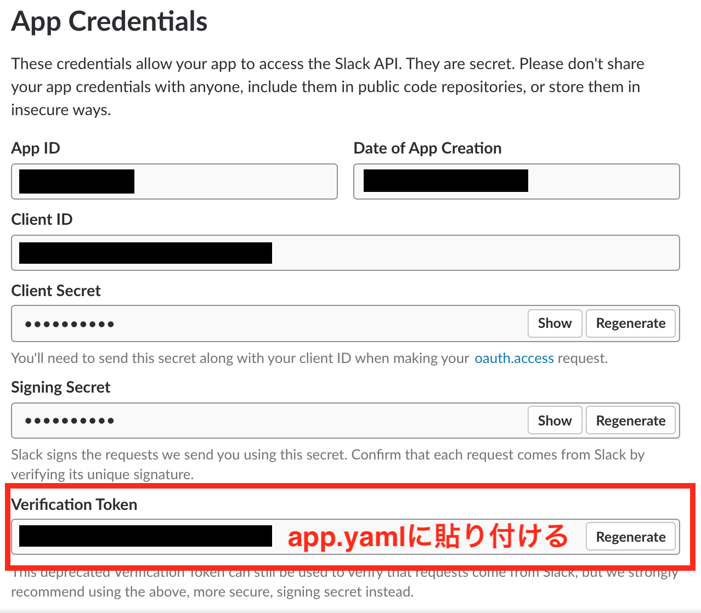
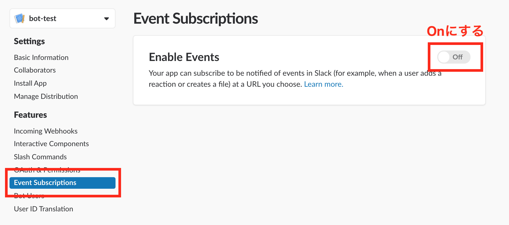
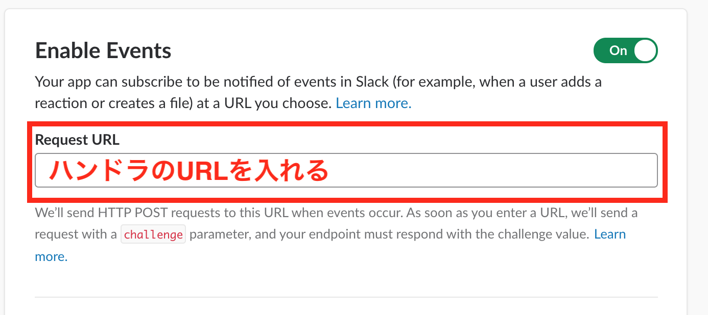

# STEP1: Hello Slack Bot

## Slackのワークスペースの作成

すでにSlack Botを自由に追加できるワークスペースがある場合はスキップしてください。

[Slack はじめてガイド](https://get.slack.help/hc/ja/articles/206845317-Slack-%E3%83%AF%E3%83%BC%E3%82%AF%E3%82%B9%E3%83%9A%E3%83%BC%E3%82%B9%E3%82%92%E4%BD%9C%E6%88%90%E3%81%99%E3%82%8B)を参考にワークスペースを作成する。

## Slack Appの作成

以下のページからSlack Appを作る

 * https://api.slack.com/apps

「Create New Appボタン」を押す。


Appの名前と対象のワークスペースを選ぶ。


## Botを追加する

Building Infomation > Add features and functionalityでBotsを選択する。


## Bot Userの追加

Bot Usersで「Add Bot User」を選択する。


名前などを入れてBot Userを作成。


## Slack Appをワークスペースにインストール

Basic InfomationのInstall your app to your workspaceで「Install App to Workspace」ボタンを押す。


Slack Appの認証を行う。


## ソースコードをデプロイする

golang.tokyoのハンズオンを参考に、Cloud Shellが使えるようにする。

* https://golangtokyo.github.io/codelab/cloud-shell-go-setup?index=codelab

Cloud Shellでソースコードを`git clone`してくる。

```
$ git clone https://github.com/tenntenn/gohandson.git
```

go getしてslackのライブラリをいれる。

```
$ go get -u github.com/nlopes/slack/...
```

バージョンv0.3.0を使う。

```
$ cd ~/gopath/src/github.com/nlopes/slack
$ git checkout v0.3.0
$ cd ~/gohandson/slackbot/ja/solution/step1/src
```

app.yamlの以下の部分をSlack Appの管理画面からコピーして貼り付ける。

```yaml
env_variables:
  SLACK_VERIFY_TOKEN: "Paste your token"
  SLACK_BOT_TOKEN: "Paste your token"
```

`SLACK_VERIFY_TOKEN:`は以下の画面からコピーする。



`SLACK_BOT_TOKEN`は以下の画面からコピーする。


Cloud ShellでGAEのアプリケーションをデプロイする。

```
$ goapp deploy --application <APP_ID> --version <VERSION> .
```

## イベントの設定をする

イベントをオンにする。



GAEのURLを貼り付ける。
例：https://VERSION-dot-slackbot-dot-APP_ID.appspot.com/events



「Add Bot User Event」ボタンを押し、`app_mention`を選択して追加する。


`Save Changes` を押す
