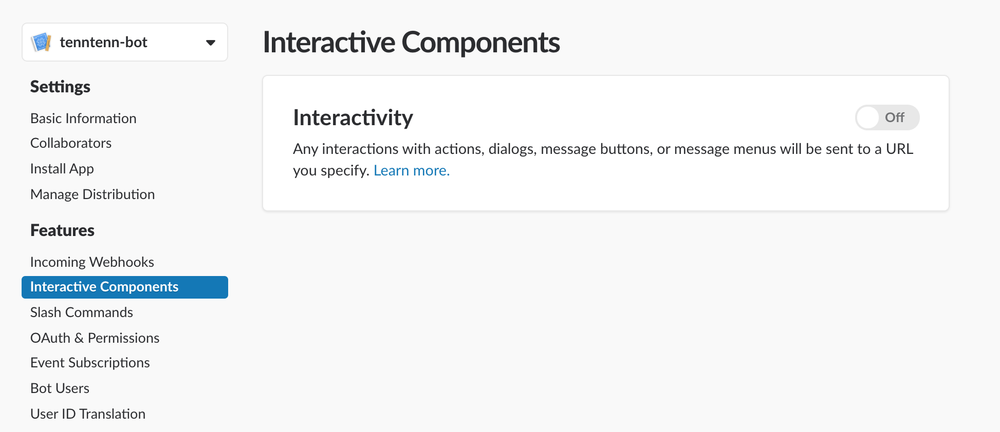
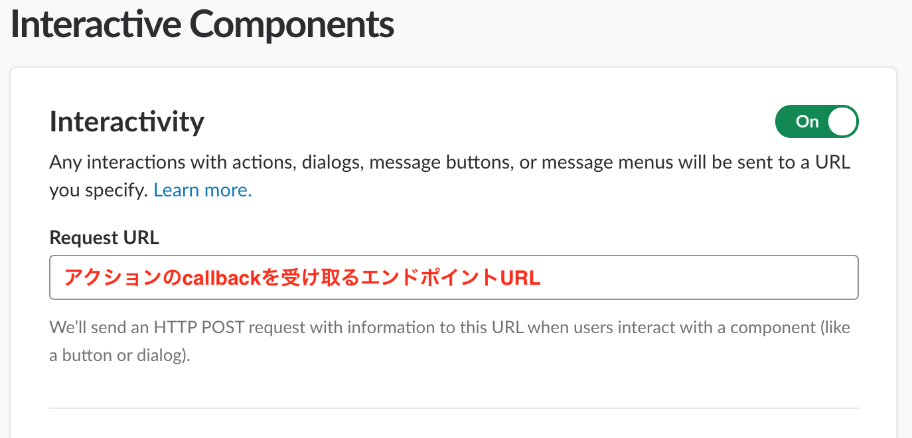
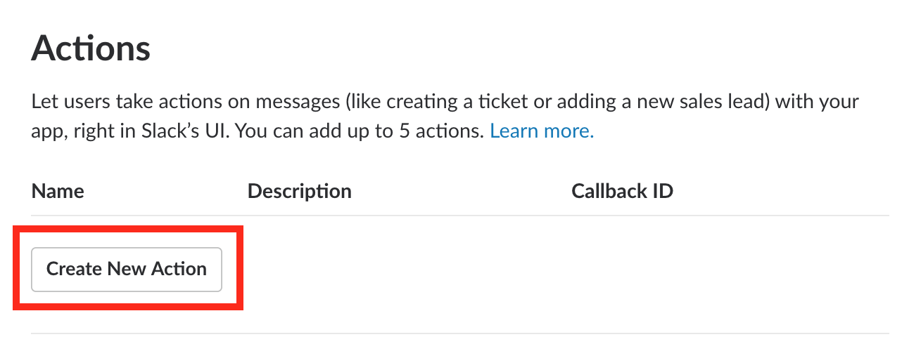
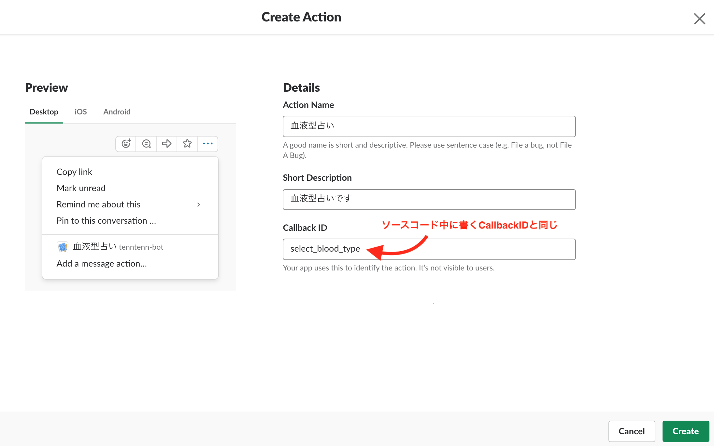
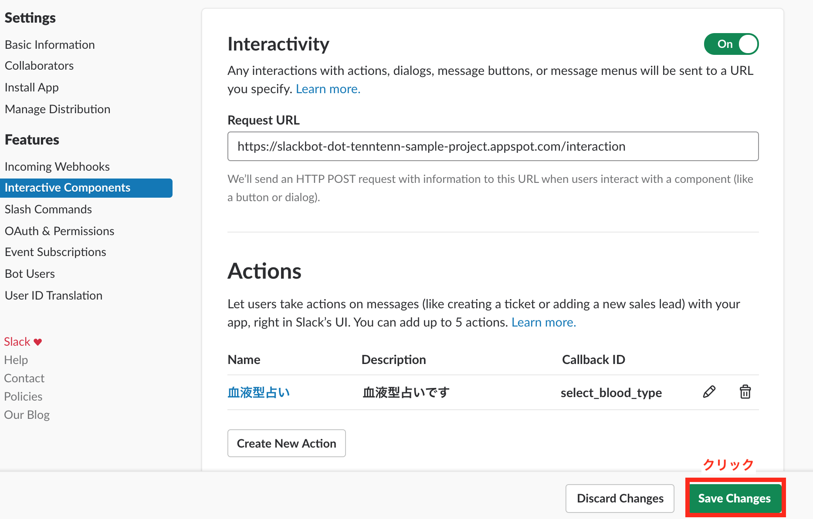
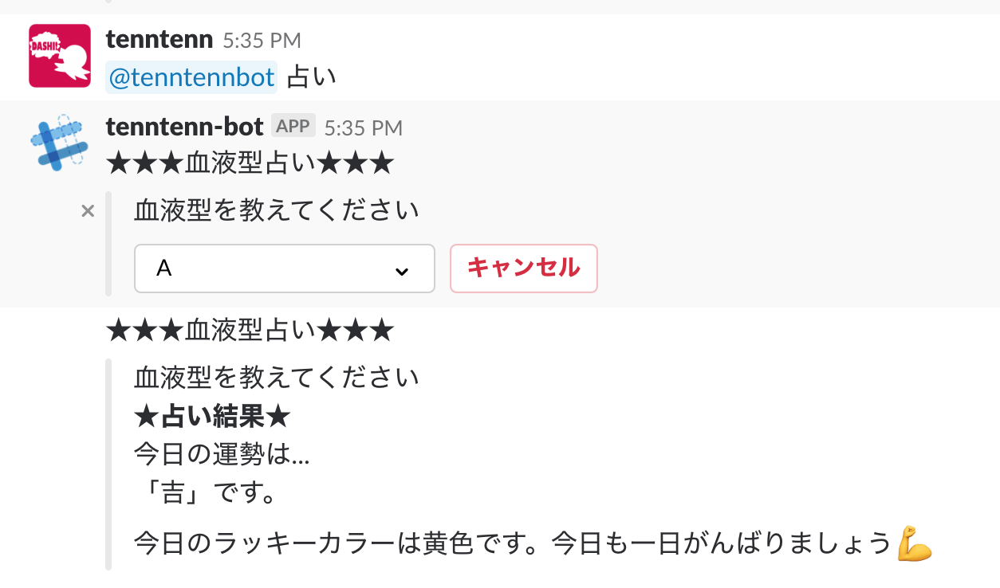

# STEP2: Interactive Message

## ソースコードをデプロイする

STEP1でやった手順と同じ。

app.yamlの以下の部分をSlack Appの管理画面からコピーして貼り付ける。

```yaml
env_variables:
  SLACK_VERIFY_TOKEN: "Paste your token"
  SLACK_BOT_TOKEN: "Paste your token"
```

```
$ cd step2/src
$ goapp deploy --application <APP_ID> --version <VERSION> .
```

## Interactive Componentsの有効化

「off」になっているので、「on」にする。



## Request URLを入れる

Request URLの部分にデプロイしたアプリケーションのURLを貼り付ける。
今回増やしたエンドポイントは`interaction`なので、そこにリクエストが来るようにする。

例：https://`VERSION`-dot-slackbot-dot-`APP_ID`.appspot.com/interaction
※ `VERSION`と`APP_ID`はデプロイ時に指定したもの。



## アクションを作る

「Create New Action」をクリックする



「Details」を入力する。CallbackIDを`select_blood_type`にする。



## 設定を保存する

「Save Changes」をクリックする。



## 動作を確認する

Slack Botのいるチャンネルで`@botname 占い`のように話しかける。


